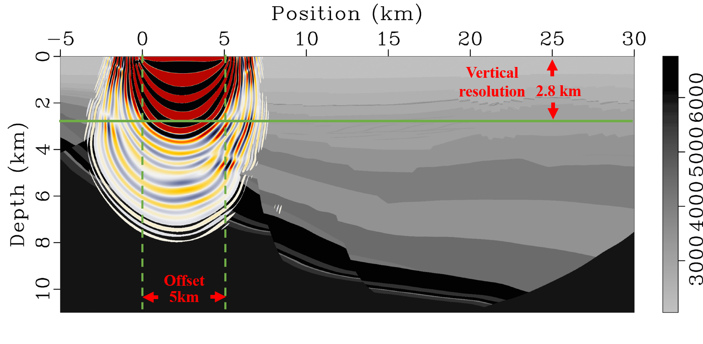
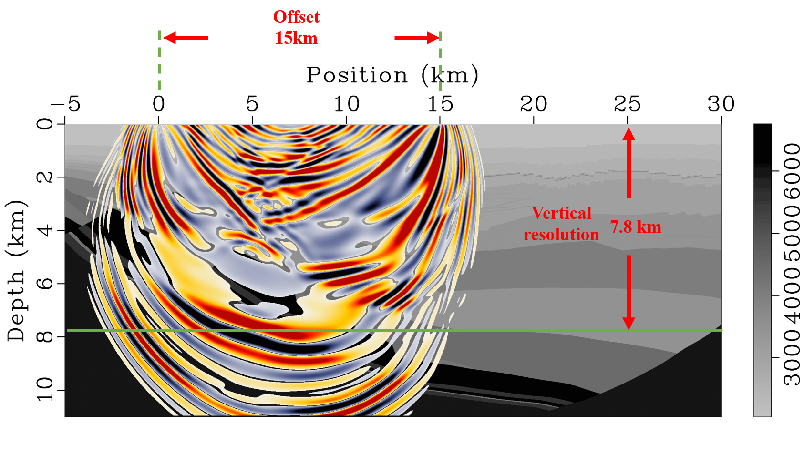

---

title: Wave field modeling and sensitive kernel analysis
subtitle: 
summary: Wave field modeling and sensitive kernel analysis
authors:
- admin
tags: [Modeling]
categories: []
projects: []
date: "2019-02-05T00:00:00Z"
lastMod: "2019-09-05T00:00:00Z"
image:
  caption: ""
  focal_point: ""
---

### 
Wave field simulation in part of the Shengli model

### 
sensitive kernel analysis

###### 
**5km reception, penetration depth of about 2.8km**

###### 
**10km reception, penetration depth of about 5km**

###### 
**15km reception, penetration depth of about 7.8km**

###### 
**20km reception, penetration depth of about 9.8km**

###### 
**25km reception, penetration depth of about 10km**

